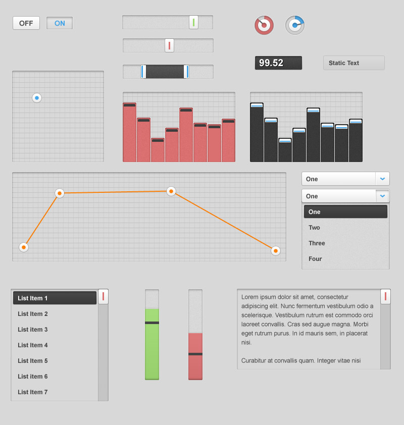

The designer [Ben de Silva](http://www.bendesilva.com/) has submitted this proposal to the GUI project. This proposal and an earlier version has been discussed by Jakob, Felix and Thor. We believe it is now in a state to be debated and considered by the developers and users of SuperCollider, so we post it to the lists.

It should be noted that the following will be controllable by the user:

- colours of all elements.
- grid on/off in views, grid size, and whether the lines are horizontal, vertical or both.
- rounded corners and the radius of that rounding.
- the drag handles might be adapted slightly by the Qt implementation.
- the 2d slider and the envelope view could have rectangles as well.
- the sunken style can be on or off (or perhaps in degrees).

What we have judged positive in this design is the fact that it is highly platform neutral, simple, yet giving SC an identifiable look. Through the controllable rounding and colouring there is scope for much adaptation in the design itself by users. Furthermore, the colouring of the elements enable another dimension of representation or encoding, so indeed quite revolutionary compared to native GUIs. All views will have bitmap background and foreground as well, which will enable the common space ship design style of audio applications.

The question is how much we want to get from the native GUI frameworks and how much should be SC specific. It should be noted that we will have more control over SC specific elements than the native ones.
